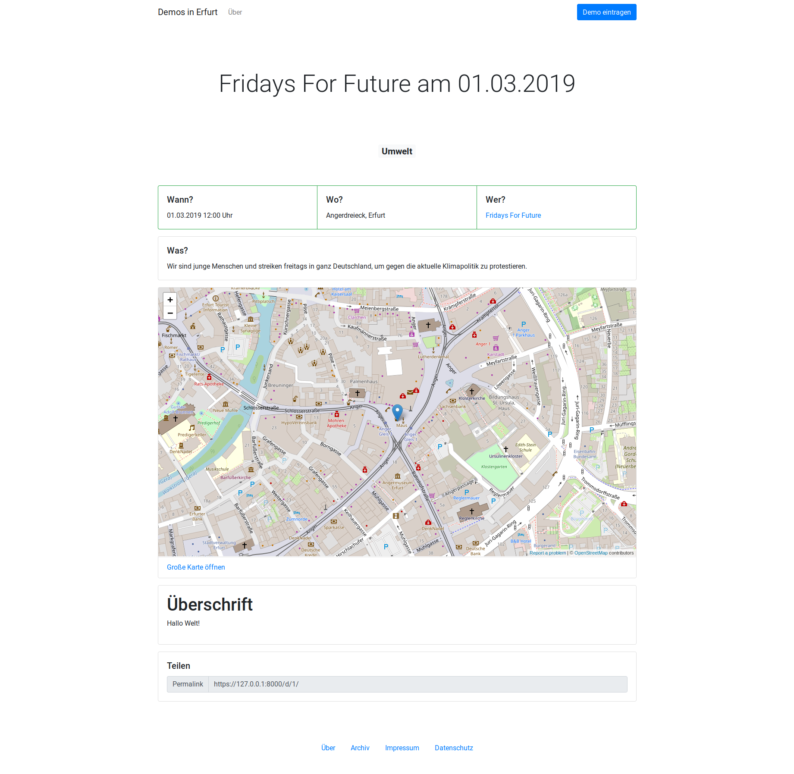

# Demostat
Statusseite für als nächstes anstehende Demonstrationen in Erfurt.

> Die Software steckt noch in der tiefsten Anfangsphase und ist extrem unvollständig! (Das hält hier aber keinen davon ab, sie trotzdem zu nutzen :P)



> Wie, gestern war wieder eine Demo? Warum weiß ich davon nix?

Leider ist diese Frage hier viel zu oft vorgekommen. Das wollen wir ändern und habe diese Website geschaffen. Auf einem Blick alle Demos der nächsten vier Wochen. Dazu gleich eine Übersichtskarte, wo sich getroffen wird und Links zu offiziellen Aufrufen, Livetickern und anderweitiges Material.

Findet die Demo erst in weiter Zukunft statt oder ist schon lange vorbei? Dann lohnt sich ein Blick in das Archiv. Sortiert nach Jahr, Monat und Tag und (blad) filterbar.

Wer steckt hinter der Demo? Auch das lässt sich ganz einfach herausfinden. Zu jeder Organisation gibt es eine kleine Zusammenfassung mit Links zur Homepage.

## Inhalte
### Startseite
Alle Demos der nächsten vier Wochen aufgelistet nach Datum.

### Archiv
Alle Demos, die eingetragen wurden, sortiert nach Jahr, Monat und Tag.

### Demo
Jeder Demo wir ein Ort und eine Organisation zugeordnet. Neben Name und kurzer Beschreibung ist noch eine Linkliste vorhanden, bei der z.B. auf den offiziellen Aufruf oder Social-Media Kanäle verwiesen werden können.

### Organisation
Jede Organisation hat einen Namen, eine kurze Beschreibung und einen Link zur Homepage.

## Installation
### Eigenständige Entwicklungsversion
Demostat Entwicklungsversion herunterladen:
```
git clone -b dev https://github.com/demostat/demostat.git
```

Abhängigkeiten installieren:
```
pip3 install -r demostat/requirements.txt
```

Neues Django Projekt starten:
```
django-admin startproject mysite
cd mysite
```

Demostat einbinden:
```
ln -s ../demostat/demostat
```

Füge in `mysite/settings.py` Demostat zu `INSTALLED_APPS` hinzu:
```
INSTALLED_APPS = [
  'demostat',
  ...
]
```
Beachte, dass Django-Admin ebenfalls geladen wird. (In der Standartinstallation sollte das schon geschehen sein)

Binde in `mysite/urls.py` Demostat-Urls ein:
```
from django.urls import include

urlpatterns = [
  path('', include('demostat.urls')),
  ...
]
```

Datenbank-Migrieren:
```
python3 manage.py migrate
```

Erstelle Administrationsaccount:
```
python3 manage.py createsuperuser
```

Starte Webserver:
```
python3 manage.py runserver
```

Website ist erreichbar über:
http://127.0.0.1:8000/

Administration über:
http://127.0.0.1:8000/admin/

## Live Betrieb

Um MySQL als Datenbank zu nutzen mus folgendes Paket installiert werden:

```bash
apt install default-libmysqlclient-dev
```

In dem Ordner welcher genutzt werden soll folgende Befehle ausführen

```bash
git clone git@github.com:demostat/demostat.git
pip3 install -r demostat/requirements.txt # Abhängigkeiten installieren
django-admin startproject mysite # Hierfür muss vorher(!) pip3 install django als **root** ausgeführt werden damit der Befehl global verfügbar ist
cd mysite
ln -s ../demostat/demostat
```

In der `mysite/settings.py` müsen folgende Zeilen zu `INSTALLED_APPS` hinzugefügt werden:

```python
INSTALLED_APPS = [
   'demostat',
   'taggit',
  ...
]
```

In der `mysite/settings.py` müsen nun die demostat Routen geladen werden:

```python
from django.urls import include

urlpatterns = [
  path('', include('demostat.urls')),
  ...
]
```

Wenn MySQL als Datenbank genutzt werden soll müssen folgende änderungen in der `mysite/settings.py` vorgenommen werden:
```python
# Verbindung zu der Datenbank
DATABASES = {
    'default': {
        'ENGINE': 'django.db.backends.mysql',
        'NAME': 'demostat',
        'USER': 'demostat',
        'PASSWORD': '<password>',
        'HOST': 'localhost',
        'PORT': '3306',
        'OPTIONS':  {
          'init_command': "SET sql_mode='STRICT_TRANS_TABLES'", # Sicherheitsmaßnahme um das Schreiben von Fehlerhaften Daten zu verhindern https://docs.djangoproject.com/en/2.1/ref/databases/#mysql-sql-mode
        },
    }
}

[...]
# Falls MySQL genutzt werden soll
# Dies ist ein Workarround um Probleme mit dem Filtern nach dem Datum zu beheben. Siehe https://stackoverflow.com/a/22043578/7142167
USE_TZ = False

[...]

# Damit statische files ordentlich ausgelagert werden
STATIC_URL = '/static/'
PROJECT_DIR = os.path.dirname(os.path.abspath(__file__))
STATIC_ROOT = os.path.join(PROJECT_DIR, '../static')

```

Nun müssen die migrations ausgeführt werden:

```python
python3 manage.py migrate
```

Statische Dateien auslagern:

```python
python3 manage.py collectstatic
```

Superuser werden über folgenden Befehl angelegt:

```python
python3 manage.py createsuperuser
```

### Unter Apache zum Laufen bringen
_Diese sektion orrientiert basiert mehr oder weniger auf Justin Ellingwood's [How To Serve Django Applications with Apache and mod_wsgi on Ubuntu 14.04 ](https://www.digitalocean.com/community/tutorials/how-to-serve-django-applications-with-apache-and-mod_wsgi-on-ubuntu-14-04)_


Vorrausgesetzt ist dabei, dass bereits apache2 installiert ist.
```bash
apt install libapache2-mod-wsgi-py3
```

Virtual host für Apache:

```apache
<VirtualHost *:80>
    . . .

    Alias /static /path/to/mysite/static
    <Directory /path/to/mysite/static>
        Require all granted
    </Directory>

    <Directory /path/to/mysite/mysite>
        <Files wsgi.py>
            Require all granted
        </Files>
    </Directory>

    WSGIDaemonProcess myproject python-path=/path/to/mysite python-home=/home/user/myproject/myprojectenv ## auskommentieren wenn ein virtual env verwendet werden soll
    WSGIDaemonProcess myproject python-path=/path/to/mysite
    WSGIProcessGroup mysite
    WSGIScriptAlias / /path/to/mysite/mysite/wsgi.py
</VirtualHost
```

```bash
a2ensite mysite.conf
systemctl reload apache2
```

**Wenn änderungen in der `mysite/settings.py` vorgenommen werden, muss apache neu geladen werden!**

```bash
systemctl reload apache2
```

## Konfigurationen
Es ist möglich Demostat über Variablen in `mysite/settings.py` zu konfigurieren.

Alle Angaben sind Optional. Entweder haben werden sie durch Vorbelegungen ersetzt oder einfach nicht angzeigt.

### String `SITE_TITLE`
Wird als Titel im Header und der Navigation genutzt.
```
SITE_TITLE = "Demos in Erfurt"
```

### Url `SITE_IMPRINT_URL`
Url zum Impressum, wird im Footer angezeigt.

### Url `SITE_PRIVACY_URL`
Url zur Datenschutzerklärung, wird im Footer angezeigt.

## Lizenz
Diese Software hat **noch** keine Lizenz. Das bedeutet, dass das deutsche Urherberrecht gilt.

Wir arbeiten fleißig daran, dass schnellstmöglich eine passende Lizenz gefunden und diese Projekt darunter veröffentlicht wird.
