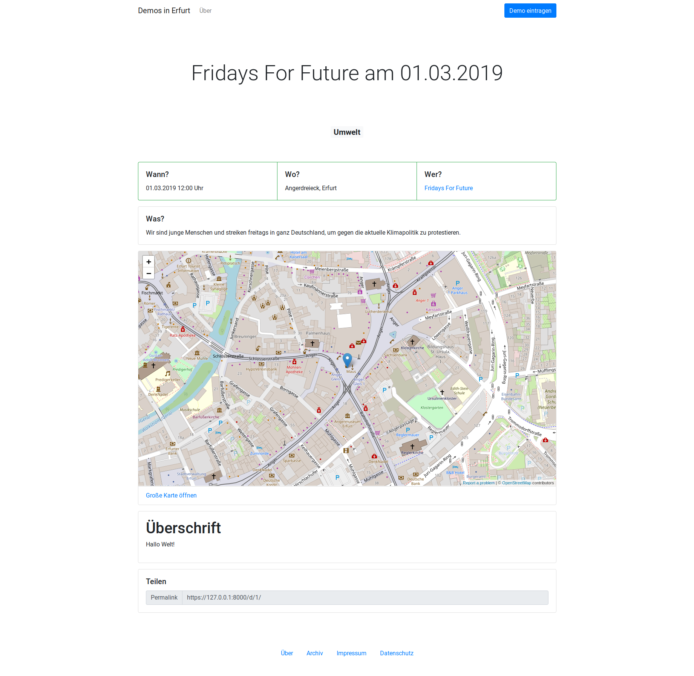

# Demostat
Statusseite für als nächstes anstehende Demonstrationen in Erfurt.

> Die Software steckt noch in der tiefsten Anfangsphase und ist extrem unvollständig! (Das hält hier aber keinen davon ab, sie trotzdem zu nutzen :P)



> Wie, gestern war wieder eine Demo? Warum weiß ich davon nix?

Leider ist diese Frage hier viel zu oft vorgekommen. Das wollen wir ändern und habe diese Website geschaffen. Auf einem Blick alle Demos der nächsten vier Wochen. Dazu gleich eine Übersichtskarte, wo sich getroffen wird und Links zu offiziellen Aufrufen, Livetickern und anderweitiges Material.

Findet die Demo erst in weiter Zukunft statt oder ist schon lange vorbei? Dann lohnt sich ein Blick in das Archiv. Sortiert nach Jahr, Monat und Tag und (blad) filterbar.

Wer steckt hinter der Demo? Auch das lässt sich ganz einfach herausfinden. Zu jeder Organisation gibt es eine kleine Zusammenfassung mit Links zur Homepage.

## Inhalte
### Startseite
Alle Demos der nächsten vier Wochen aufgelistet nach Datum.

### Archiv
Alle Demos, die eingetragen wurden, sortiert nach Jahr, Monat und Tag.

### Demo
Jeder Demo wir ein Ort und eine Organisation zugeordnet. Neben Name und kurzer Beschreibung ist noch eine Linkliste vorhanden, bei der z.B. auf den offiziellen Aufruf oder Social-Media Kanäle verwiesen werden können.

### Organisation
Jede Organisation hat einen Namen, eine kurze Beschreibung und einen Link zur Homepage.

## Dokumentation & Installation

https://docs.demostat.de

### Selber bauen

```
pip3 install sphinx
cd docs/
make html
```

Die fertigen HTML sind dann unter `docs/_build/html/` verfügbar.

## Lizenz
Diese Software hat **noch** keine Lizenz. Das bedeutet, dass das deutsche Urherberrecht gilt.

Wir arbeiten fleißig daran, dass schnellstmöglich eine passende Lizenz gefunden und diese Projekt darunter veröffentlicht wird.
